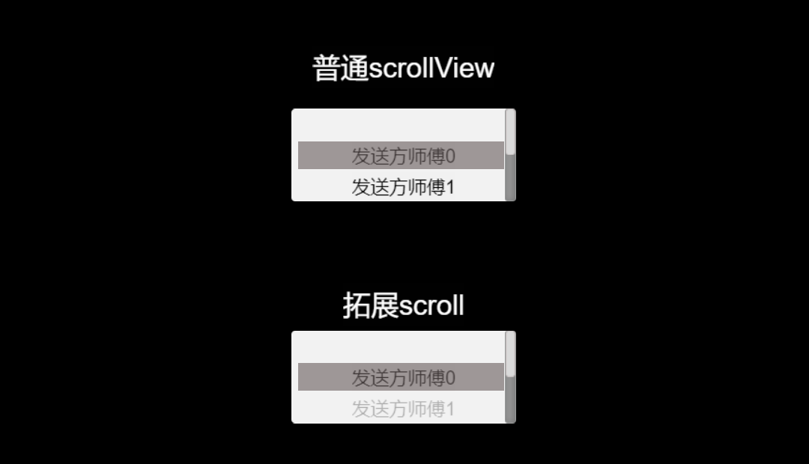

### creator 拓展组件，在没有修改引擎脚本的情况下拓展一些组件

* ScrollView
1. 增加scrollBar滑动功能，能够像浏览器拖动条一样使用
2. 增加scrollview子区间选中功能，类似于ios上日历选择组件

[预览链接](https://dengxiaochun.github.io/CocosCreatorExtra/build/web-mobile/index.html?scene=ScrollView)
